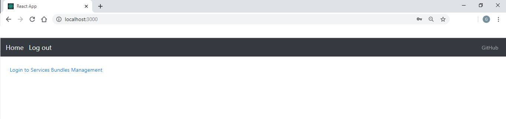
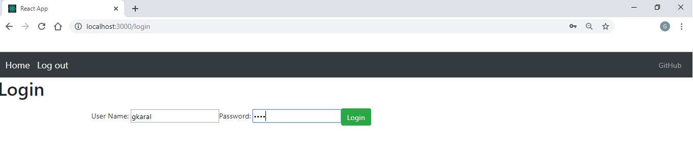
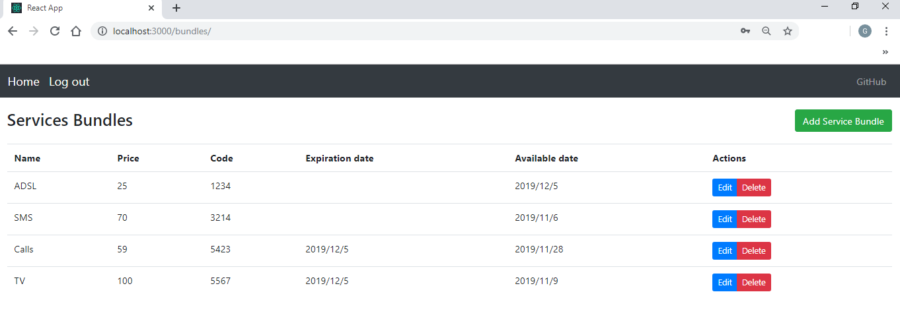

Spring Boot back-end exposing REST API endpoints - performing CRUD operations. Post-greSQL database used for storage. Front-end using React JS to create the user interface. Spring Security, post-login generate JWT authentication token to access API

# Service Bundles Managment Application 

 ### Home page

### We  login to the application using "gkaral" account and "1234" as password

